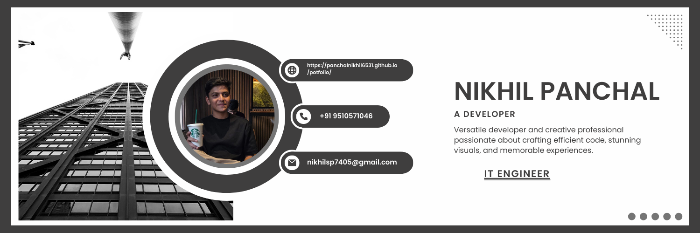

<h1 align="center">Hi 👋, I'm Panchal Nikhil S</h1>
<h3 align="center">Frontend Developer | IT Undergraduate | India 🇮🇳</h3>

  

---

## 🚀 About Me

- 🎓 **B.Tech IT Student (3rd Semester)**
- 💻 Passionate about **Frontend Development & Web Technologies**
- 🌱 Currently learning **Advanced JavaScript, React & UI/UX**
- 🛠️ Strong foundation in **Programming & Problem Solving**
- 🎯 Career Goal: **Frontend / Software Developer**
- ⚡ Fun fact: *I enjoy coding with creativity 😄*

---

## 🧑‍💻 Skills & Technologies

### 💡 Programming Languages
- C, C++, Java, Python, JavaScript

### 🌐 Web Technologies
- HTML5, CSS3, JavaScript
- React.js (Basics)
- Responsive Web Design

### 🛠 Tools & Platforms
- Git & GitHub
- VS Code
- Windows / Linux (Basics)

---

## 🔗 Connect With Me

  
  
  
  

---

## 📂 Projects

👉 Check out my projects on GitHub  
🔗 **LinkedIn Portfolio:**  
[https://www.linkedin.com/in/nikhil-s-panchal-463a78319](https://www.linkedin.com/in/nikhil-s-panchal-463a78319)

---

## 📊 GitHub Stats

  

  

  

---

## 📫 Contact

- 📧 Email: **nikhilsp7405@gmail.com**
- 💬 Ask me about **Web Development, Python, Java, C/C++**

⭐ *If you like my work, consider giving a star to my repositories!*
