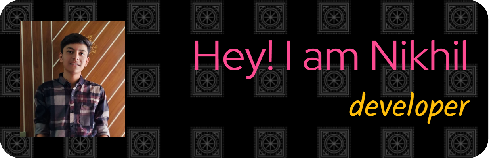

<h1 align="center">Hi 👋, I'm Panchal Nikhil S</h1>
<h3 align="center">A passionate frontend developer from India</h3>

  

  

- 👨‍💻 All of my projects are available at [https://www.linkedin.com/in/nikhil-s-panchal-463a78319?utm_source=share&utm_campaign=share_via&utm_content=profile&utm_medium=android_app](https://www.linkedin.com/in/nikhil-s-panchal-463a78319?utm_source=share&utm_campaign=share_via&utm_content=profile&utm_medium=android_app)

- 📝 I regularly upload post and content on [https://www.instagram.com/nikhilspanchal25?igsh=anRsajVhNGN6MG80](https://www.instagram.com/nikhilspanchal25?igsh=anRsajVhNGN6MG80)

- 💬 Ask me about **web development , python ,java ,c ,c++**

- 📫 How to reach me **nikhilsp7405@gmail.com**

- ⚡ Fun fact **i am funny**

<h3 align="left">Connect with me:</h3>

<h3 align="left">Languages and Tools:</h3>

       

&nbsp;

